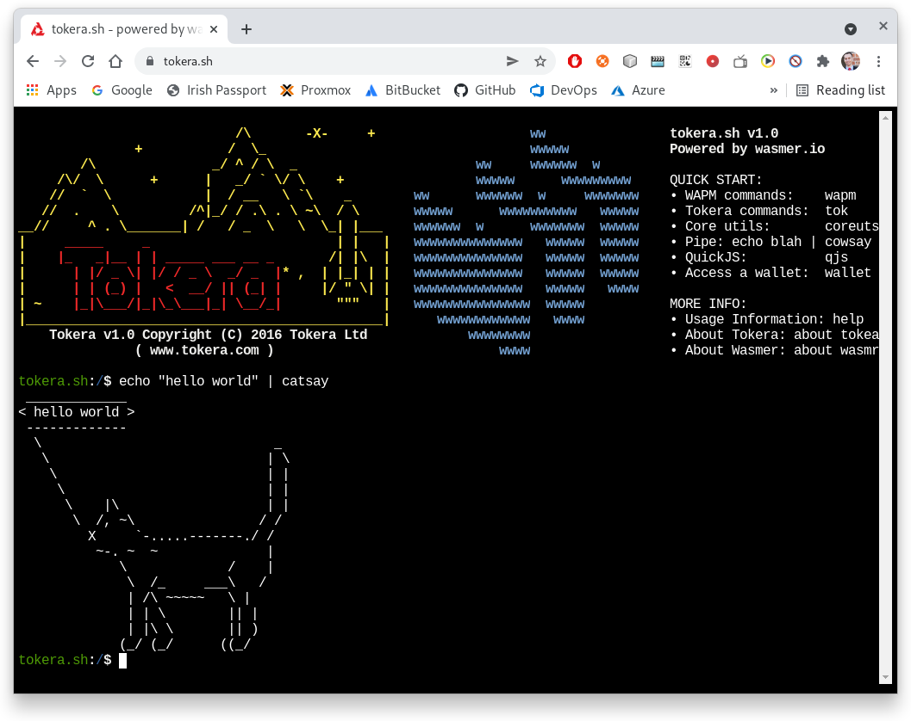

# Tokera Terminal

The Web Tokera Terminal running the Tokera Terminal in your browser
rather than on a local machine.

Use it here (https://tokera.sh/)

# Screenshots

# Functionality

- Web Socket connections
- HTTP and HTTPS calls
- Spawning sub-processes
- Thread sleeping and timeouts
- Asynchronous Runtime Engine
- Multi-threaded Runtime Engine

# TODO

- Spawning threads
- Universal Logging
- Server side invocation of WASM modules
- Client side invocation of WASM modules